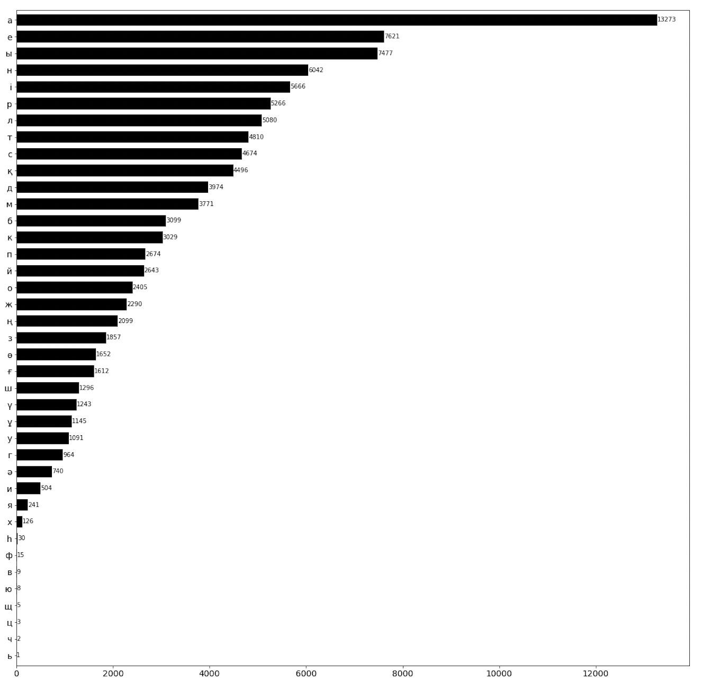

# Abai
A dataset of works by **[Abai Qunanbaiuly](https://en.wikipedia.org/wiki/Abai_Qunanbaiuly)** (1845 – 1904), a great Kazakh poet, composer, and philosopher
```
BBBBBBBBBBBAAAAAAAAAAAAAAAAAAAAAAAAAAAAAAAAAAAAAAAAAAAAAAAAAAAAAAAABBBBBBBBBBBBB
BBBBBBAAAAAAAAAAAAAAAAAAAAAAAAAAAAAAAAAAAAAAAAAAAAAAAAAAAAAAAAAAAAAAABBBBBBBBBBB
BBBBBAAAAAAAAAAAAAAAAAAAAAAAAAAABBBBBABBBBBBBAAAAAAAAAAAAAAAAAAAAAAAABBBBBBBBBBB
BBBAAAAAAAAAAAAAAAAAAAAAAAAAABBAAAAAAAAABBBBBAAAAAAAAAAAAAAAAAAAAAAAAABBBBBBBBBB
AAAAAAAAAAAAAAAAAAAAAAAAAAABBAAAAAAAAABBBBBBBAAAAAAAABBBAAAAAAAAAAAAAAAABBBBBBBB
AAAAAAAAAAAAAAAAAAAAAAAAAABBAAABBBAAAAAAAAAAAAAAAAAAABBBBBAAAAAAAAAAAAAAAABBBBBB
AAAAAAAAAAAAAAAAAAAAAAAABBAABBAAIIIIIIIIIIIIIIIIIIAABBBBBBBBAAAAAAAAAAAAAAAABBBB
AAAAAAAAAAAAAAAAAAAAIIABBBAAAAAIIIIIIIIIIIIIIIIIIIIIIAABBBBBBAAAAAAAAAAAAAAAABBB
AAAAAAAAAAAAAAAAAIIIIABBAAAAAAIIIIIIIIIIIIIIIIIIIIIIIIIIABBBBAAAAAAAAAAAAAAAAABB
AAAAAAAAAAAAAAAIIIIIIABAAAABAAIIIIIIIIIIIIIIIIIIIIIIIIIIIABBBBAAAAAAAAAAAAAAAAAB
AAAAAAAAAAAAAAIIIIIIABAAAAAAAAIIIIIIIIIIIIIIIIIIIIIIIIIIIABAABAAAAAAAAAAAAAAAAAA
AAAAAAAAAAAAAIIIIIIIBBAAAABBBBBBAAAIIIIIIIIIIIIIAAAAAAIIIIBBABAIIAAAAAAAAAAAAAAA
AAAAAAAAAAAIIIIIIIIIBBAAAAAAAAAAAABBAAIIIIIAAABBBAAAAAAIIIAAABBAIIAAAAAAAAAAAAAA
AAAAAAAAAAAIIIIIIIIABAAAABBBBBAAIIIIABAIIIAAAABAIIIIIAAAIIIAABBAIIAAAAAAAAAAAAAA
AAAAAAAAAAAIIIIIIIIABAAAAABBBBBBBAAAAABIIIAABBBBBAAAAAAAIIIIBBBAIIIAAAAAAAAAAAAA
AAAAAAAAAAIIIIIIIAAAAAAAAIAABAAAAIIAAABIIIIAAAABAIAABBAAAIIIAAAAIIIAAAAAAAAAAAAA
AAAAAAAAAIIIIIIIIBBAAAAAAAAAAAAAAAAABBAIIIIIIAAAAAIIIAAAIIIIABIAAIIIAAAAAAAAAAAA
AAAAAAAAAIIIIIIIIBABAABBAAIIIIIIIIABBBAIIIIIIIIIIIIIIIIIIIIIAAABBAIIAAAAAAAAAAAA
AAAAAAAAIIIIIIIIIAABAABBAAIIIIIIIIABBBAIIIIIIAIIIIIIIIIIIIIIAAAAAAIIAAAAAAAAAAAA
AAAAAAAAIIIIIIIIIIABAABBBAAIIIIIAAABBBAAIAAIIAAAIIIIIIIIIIAAAAAAAIIIAAAAAAAAAAAA
AAAAAAAAIIIIIIIIIIAAAAAABAAAIIIABBABAABBAABAIIIAAIIIIIIIIAAAAAAAAIIAAAAAAAAAAAAA
AAAAAAAAAIIIIIIIIIIAAAAAAAAAAAAABBBBBBAAAAAAIIIIIIIIIIAAAAAAAAAAIIIAAAAAAAAAAAAA
AAAAAAAAAIIIIIIIIIIIAAAAAAAAAAABBBBBBAAAAAAAAAAIIIIIIIAAAAAAAIAIIIIAAAAAAAAAAAAA
AAAAAAAAAIIIIIIIIIIIIIAAAAAAAABBBAAAABBABBBBBABIIIIAAAAAAAAAAAAIIIIAAAAAAAAAAAAA
AAAAAAAAAAIIIIIIIIIIIAAAABBBAABBAAABBBAAAAAABBBAIAIAAAAAAAAAIIIIIIAAAAAAAAAAAAAA
AAAAAAAAAAIIIIIIIIIIABAAAABBBBBBAAAABBBBBAAABBBBAAAAAAAAAAAAIIIIIIAAAAAAAAAAAAAA
AAAAAAAAAAAIIIIIIIIIBBBAAABBBBBABBBBBBABBAAABBBBBAAAAAAAAAAIIIIIIAAAAAAAAAAAAAAA
AAAAAAAAAAAAIIIIIIIAAABBAAABBBBBBBABAAAAAIIIAAABAAAAAAAAAAIIIIIIAAAAAAAAAAAAAAAA
AAAAAAAAAAAAAAAAABBAAAABBBAAABBBABAAIIIIIIIIAIAAIIAAAAAAAAIIIIIAAAAAAAAAAAAAAAAB
AAAAAAAAAAAABBBAAAAAAAAABBBAABBBBBBAAAIIAAIIIAIIIIIAAAAAAAAAAAAAAAAAAAAAAAAAAAAB
AAAAAAABBBAAAAAAAAAAAAAABAABBABBABBBBBAAAAAAAAIIIIIABAAAAAAABBBBBAAAAAAAAAAAAABB
ABBBBAAAAAAAAAAAAAAAAAABBBAABBBBABBBBBAAAAAAAAAAIIABAAIAIABAABBBBBBBBBBBBBAAABBB
BAAAAAAAAAAAAAAAAAAAAAABBBBBABBBAAABABAAIIABAAAIIAAAAAAAIABBAABBBBBBBBBBBBBBBBBB
AAAAAAAAAAAAAAAAAAAAABBBBBBBBBBBAAABBABAIIABAAAIAAAAAAAIAABBBBBBBBBBBBBBBBBBBBBB
AAAAAAAAAAAAAAAAAAAABBBBBBBBBBBBABAABBBBAAAAAAIIAAAAAIIAAABABABBBBBBBBBBBBBBBBBB
AAAAAAAAAAAAAAAAAABBBBBBBBBBBBBBBBBABBBBAAAAAAAAAAAAAAAAAABABAAABBBBBBBBBBBBBBBB
AAAAAAAAAAAAAAAAAAABBAAAABBBBBBBBBBBBBBBBABAAAAAAAAAAAAAAABABBAAAAABBBBBBBBBBBBB
AAAAAAAAAAAAAABAAAAABBAAAAABBBBBBBBBBBBBBAAAAAAAAAABBBBBAABBBAAAAAABBBBBBBBBBBBB
AAAAAAAABBBBBBBBBAAAABBBBBBBBBBBBBBBBBBBAAAAAAAAAAAAAABBBBBBAAAAAAABBBBBBBBBBBBB
AAAAABBBBBBBBBBBBBAAABBBBBBBBBBBBBBBBBBBAAAAAAAAAAAAAAAAABABAAAAAABBBBBBBBBBBBBB
```
# abai_verses.csv
 - The file contains 176 verses by Abai Qunanbaiuly and their Russian translations.
 - 168 verses were written in the period between 1855 and 1903; the exact years of eight verses are unknown.
 - 21 verses have no Russian translations.
 - There are 43 translators.
 - A translator's name can be given more than once if there are multiple variants of a verse by the same translator.
 - With punctuation and \n removed:
   - the number of tokens in the **kk_text** column is 19,190.
   - the number of types in the **kk_text** column is 8,099.
   - the number of unique letters in the **kk_text** column is 40.
 
 
 
